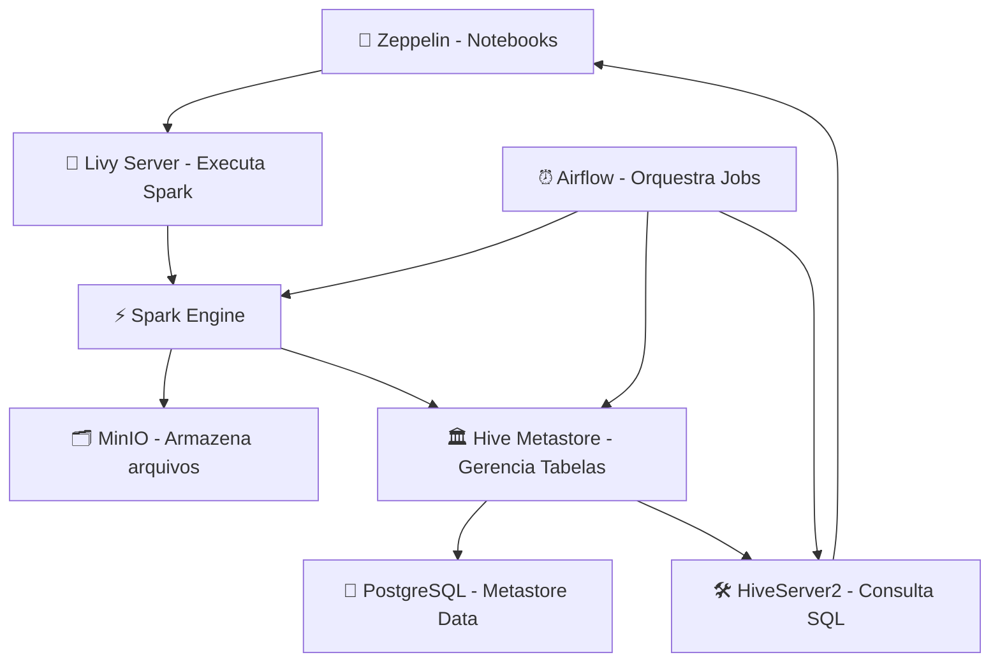

# Ambiente Big Data para aplicação

Este ambiente foi construído com **Docker Compose** para simular uma stack de **Big Data**, com orquestração de pipelines, notebooks analíticos e integração de bancos de dados.  
Todos os principais serviços utilizam **volumes** para persistência de dados, notebooks, configurações, além de garantir o funcionamento correto de conexões como **Livy-Spark**, **Hive Metastore**, **MinIO**, **Airflow** e **Zeppelin**.

## Estrutura de Serviços

### 1. Livy-Spark
- Serviço responsável por expor uma API REST para envio de jobs Spark.
- Conectado diretamente ao Zeppelin para execução remota.
- **Volumes:**
  - `./docker/volume/livy/conf` ➔ `/opt/livy/conf`
  - `./docker/volume/spark/conf` ➔ `/opt/spark/conf`
- **Portas:**
  - 8998: API Livy
  - 18080: Spark UI
  - 4040: Spark Application UI
- **Hostname:** `livy`
- **Rede:** `bigdata-docker`

### 2. Zeppelin
- Ambiente de notebooks que permite criação de notebooks integrados ao Livy-Spark, Hive e outras fontes de dados.
- **Volumes:**
  - `./docker/volume/zeppelin/notebook` ➔ Armazenamento dos notebooks
  - `./docker/volume/zeppelin/conf/interpreter.json` ➔ Configurações dos interpreters (Livy, Hive, etc)
- **Porta:** 8080
- **Dependências:** Espera o serviço **Livy-Spark** para iniciar corretamente.
- **Variáveis de Ambiente:**
  - `ZEPPELIN_ADDR=0.0.0.0`
- **Rede:** `bigdata-docker`

### 3. MinIO
- Serviço de armazenamento de objetos compatível com S3 (usado para integração de dados).
- **Volumes:**
  - `./docker/volume/minio/data` ➔ `/data`
- **Portas:**
  - 9000: API de Objetos
  - 9001: Console Web de Administração
- **Comando:** Inicia o MinIO apontando o console para a porta 9001.
- **Rede:** `bigdata-docker`

### 4. PostgreSQL
- Banco de dados usado como **Metastore** para o Hive e backend para o Airflow.
- **Volumes:**
  - `./docker/volume/postgres/data` ➔ `/var/lib/postgresql/data`
- **Porta:** 5432
- **Variáveis de Ambiente:**
  - Usuário: `admin`
  - Senha: `admin`
  - Database: `metastore_db`
- **Healthcheck:** Garante que o banco esteja pronto antes de outros serviços tentarem conectar.
- **Rede:** `bigdata-docker`

### 5. Hive Metastore
- Serviço de Metastore para o Hive, persistindo metadados no PostgreSQL.
- **Volumes:**
  - `./docker/volume/hive/conf/hive-site.xml` ➔ Configurações do Hive
- **Porta:** 9083
- **Variáveis de Ambiente:**
  - `SERVICE_NAME=metastore`
  - `DB_DRIVER=postgres`
- **Rede:** `bigdata-docker`

### 6. HiveServer2
- Permite consultas SQL sobre dados Hive, também usado como interpretador no Zeppelin.
- **Volumes:**
  - `./docker/volume/hive/conf/hive-site.xml` ➔ Configuração Hive
  - `./docker/volume/hadoop/conf/core-site.xml` ➔ Configurações Hadoop/S3 (MinIO)
- **Portas:**
  - 10000: JDBC/ODBC
  - 10002: Serviço de Transporte
- **Variáveis de Ambiente:**
  - `AWS_ACCESS_KEY_ID=minioadmin`
  - `AWS_SECRET_ACCESS_KEY=minioadmin`
  - Configura URI do metastore (`hive.metastore.uris`)
- **Rede:** `bigdata-docker`

### 7. Redis
- Backend usado para comunicação Celery no Airflow (Broker para Workers).
- **Exposição Interna:** Porta 6379.
- **Rede:** `bigdata-docker`

### 8. Apache Airflow
Implementado com o executor **CeleryExecutor** e separado em vários containers:

#### 8.1 Airflow Webserver
- Interface de gerenciamento do Airflow.
- **Porta:** 8081 (mapeada para 8080 interno)
- **Volumes:**
  - Dags: `./docker/volume/airflow/dags`
  - Logs: `./docker/volume/airflow/logs`
  - Configurações: `./docker/volume/airflow/config`
  - Plugins: `./docker/volume/airflow/plugins`
- Cria o usuário admin padrão com variáveis `_AIRFLOW_WWW_USER_USERNAME` e `_AIRFLOW_WWW_USER_PASSWORD`.

#### 8.2 Airflow Scheduler
- Serviço responsável por agendar a execução dos DAGs.

#### 8.3 Airflow Triggerer
- Gerencia as tarefas baseadas em triggers (event-driven).

#### 8.4 Airflow Worker
- Responsável por executar as tasks enviadas pelo Scheduler via Celery.

Todos os serviços compartilham:
- Conexão com PostgreSQL para Metastore
- Redis para filas de tarefas Celery
- Configuração comum via variáveis de ambiente

**Observação**: Airflow configurado para não carregar DAGs de exemplo, usando autenticação básica para a API e interface.

---

## Volumes Persistentes
Os volumes garantem que ao parar ou recriar os containers, seus dados, configurações e notebooks não sejam perdidos:

| Serviço     | Volume Local | Volume no Container |
|-------------|--------------|----------------------|
| Livy        | ./docker/volume/livy/conf | /opt/livy/conf |
| Spark       | ./docker/volume/spark/conf | /opt/spark/conf |
| Zeppelin    | ./docker/volume/zeppelin/notebook | /zeppelin/notebook |
| Zeppelin    | ./docker/volume/zeppelin/conf/interpreter.json | /zeppelin/conf/interpreter.json |
| MinIO       | ./docker/volume/minio/data | /data |
| PostgreSQL  | ./docker/volume/postgres/data | /var/lib/postgresql/data |
| Hive        | ./docker/volume/hive/conf/hive-site.xml | /opt/hive/conf/hive-site.xml |
| Hadoop      | ./docker/volume/hadoop/conf/core-site.xml | /opt/hadoop/etc/hadoop/core-site.xml |
| Airflow     | ./docker/volume/airflow/dags | /opt/airflow/dags |
| Airflow     | ./docker/volume/airflow/logs | /opt/airflow/logs |
| Airflow     | ./docker/volume/airflow/config | /opt/airflow/config |
| Airflow     | ./docker/volume/airflow/plugins | /opt/airflow/plugins |

---

## Como subir o ambiente

```bash
docker-compose up --build
```

> **Importante:** Certifique-se que as pastas de volumes estão criadas localmente, ou o Docker criará diretórios vazios.

---

## Acessos Rápidos

| Serviço     | URL                          |
|-------------|-------------------------------|
| Zeppelin    | http://localhost:8080          |
| Spark UI    | http://localhost:18080         |
| MinIO       | http://localhost:9001          |
| Airflow     | http://localhost:8081          |
| Livy API    | http://localhost:8998          |
| HiveServer2 | JDBC/Beeline: `jdbc:hive2://localhost:10000` |

---

## Observações
- A comunicação entre Livy e Spark é local via container.
- O Zeppelin está pré-configurado para conectar no Livy e no HiveServer2.
- MinIO pode ser usado como storage S3 para ingestão ou exportação de dados do Hive.
- O Airflow está 100% configurado para pipelines em DAGs customizados na pasta `/dags`.

---

Perfeito! Vamos fazer os dois então:

---

# 📁 Estrutura de Pastas do Projeto

Aqui está a sugestão da estrutura organizada:

```
bigdata-docker/
│
├── docker-compose.yml
├── README.md
│
├── docker/
│   ├── volume/
│   │   ├── airflow/
│   │   │   ├── dags/
│   │   │   ├── logs/
│   │   │   ├── config/
│   │   │   └── plugins/
│   │   ├── hive/
│   │   │   └── conf/
│   │   │       └── hive-site.xml
│   │   ├── hadoop/
│   │   │   └── conf/
│   │   │       └── core-site.xml
│   │   ├── livy/
│   │   │   └── conf/
│   │   ├── spark/
│   │   │   └── conf/
│   │   ├── minio/
│   │   │   └── data/
│   │   ├── postgres/
│   │   │   └── data/
│   │   └── zeppelin/
│   │       ├── notebook/
│   │       └── conf/
│   │           └── interpreter.json
│   └── Dockerfile (se necessário customizar algum container)
│
└── dags/ (opcional se quiser separar fora do volume)
```

> **Notas:**
> - Os arquivos `hive-site.xml` e `core-site.xml` precisam estar já configurados para apontar para PostgreSQL e MinIO.
> - Os notebooks criados no Zeppelin serão armazenados em `docker/volume/zeppelin/notebook/`.

---

# 📊 Diagrama de Arquitetura

Aqui está a arquitetura resumida do ambiente:



- **MinIO** é usado como *storage* para dados brutos ou intermediários.
- **Hive Metastore** persiste metadados de tabelas no **PostgreSQL**.
- **Airflow** agenda pipelines que podem envolver jobs Spark (via Livy) e consultas no Hive.
- **Zeppelin** é o ambiente de desenvolvimento para notebooks exploratórios, conectado tanto ao Hive quanto ao Livy.