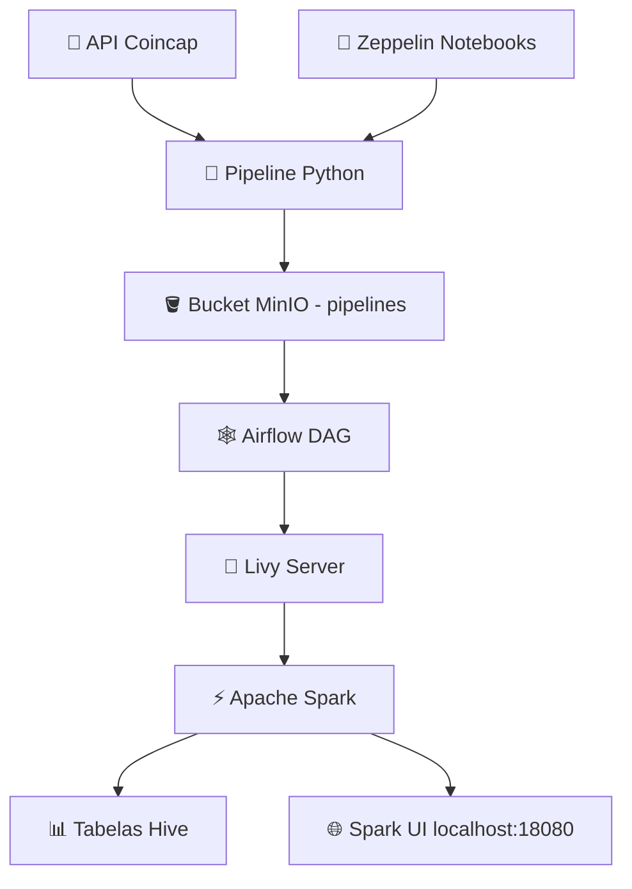

# 💡 Pipeline Coincap - Documentação Técnica

## 📌 Visão Geral

Este ambiente foi desenvolvido para orquestrar o consumo, transformação e armazenamento de dados da API Coincap, utilizando as seguintes ferramentas:

- **Apache Zeppelin**: notebooks para desenvolvimento e explicação dos processos.
- **Apache Livy + Apache Spark**: processamento distribuído dos dados.
- **MinIO**: armazenamento de arquivos, como pipelines.
- **Apache Airflow**: orquestração da execução dos scripts.
- **Hive Metastore**: persistência das tabelas resultantes em formato Hive.

---

## 📒 Notebooks Zeppelin

O Zeppelin contém **2 notebooks principais**, organizados da seguinte forma:

### 1. `Criação e Explicação das Tabelas Hive`

Este notebook contém os códigos de criação e explicações das tabelas Hive utilizadas no processo.

#### 🧾 Tabela `ativos_coincap`

Tabela consolidada com os principais dados dos ativos (criptomoedas) extraídos da API Coincap.

**Campos principais:**

- `id`: Identificador único do ativo.
- `nome`: Nome da moeda.
- `simbolo`: Símbolo de mercado (ex: BTC, ETH).
- `ranking`: Posição por capitalização de mercado.
- `preco_usd`: Preço atual em USD.
- `variacao_percentual_24h`: Variação percentual nas últimas 24h.
- `capitalizacao_mercado_usd`: Valor total de mercado.
- `volume_24h_usd`: Volume negociado em 24h.
- `suprimento`: Quantidade atual disponível.
- `suprimento_maximo`: Limite máximo do ativo.
- `razao_suprimento`: Razão entre suprimento atual e o máximo.
- `categoria_capitalizacao`: Classificação de capitalização (grande, média, pequena).
- `numero_exchanges`: Exchanges em que o ativo é negociado.
- `desvio_padrao_preco`: Volatilidade (desvio padrão do preço).

---

#### 🧾 Tabela `mercados_coincap`

Contém informações detalhadas sobre os mercados de negociação dos ativos (pares nas exchanges).

**Campos principais:**

- `id_base`: ID do ativo base.
- `simbolo_base`: Símbolo do ativo base.
- `id_exchange`: ID da exchange.
- `percentexchangevolume`: Percentual do volume do par na exchange.
- `pricequote`: Preço em relação ao ativo de cotação.
- `preco_usd`: Preço convertido em USD.
- `id_cotacao`: ID da moeda de cotação.
- `simbolo_cotacao`: Símbolo da moeda de cotação.
- `rank`: Ranking do par na exchange.
- `tradescount24hr`: Número de negociações em 24h.
- `updated`: Timestamp da última atualização.
- `volume_usd_24h`: Volume em USD negociado em 24h.

---

### 2. `Pipeline Python`

Este notebook detalha o fluxo completo, em Python, que realiza:

- Consumo da API Coincap.
- Processamento dos dados com Spark.
- Escrita final das tabelas Hive (`ativos_coincap` e `mercados_coincap`).

---

## 🛠️ Execução via Airflow

O **Apache Airflow** executa automaticamente o pipeline Coincap por meio de uma DAG que:

1. Cria a conexão com o **Livy Server**.
2. Envia o script Python (`pipeline_coincap.py`) armazenado no **bucket MinIO `pipelines`**.

---

## 📁 Atualizações de Código

- Para **atualizar o código do pipeline**, edite o arquivo localmente e atualize o conteúdo do bucket no MinIO:
  - Bucket: `pipelines`
  - Nome do arquivo: `pipeline_coincap.py`

- Para **atualizar a DAG no Airflow**, edite o arquivo local localizado em:

```text
docker/volume/airflow/dags/
```

---

## 🔍 Monitoramento da Execução

- Para acompanhar a execução do Spark, acesse a interface web do Spark via:

```
http://localhost:18080
```

Essa página exibe o histórico e status dos jobs Spark executados via Livy.

---

## 🔗 Arquitetura do Ambiente



---

## ✅ Considerações Finais

- O script Python e a DAG podem ser atualizados separadamente.
- Todo o pipeline é modular e auditável via Zeppelin, Spark UI e Airflow.
